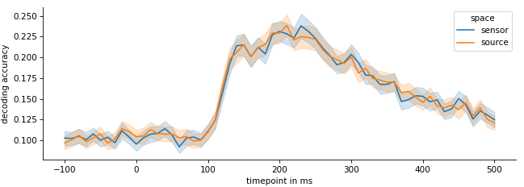

## Brain decoding in MEG source space using MNE-Python

This blog post will walk you through the steps required for source reconstructed brain decoding using MEG and MNE-Python.  

A lot of MEG decoding work is performed on raw sensor data, even though it seems that source based decoding should be superior, based upon the accuracy of fMRI decoding approaches. I always wondered why this is seldomly done, so in this blog post I want to explore **decoding visual perception** processes from source reconstructed localizer data. Additionally, there are very few tutorials out there doing source space decoding and it can be confusing at first which steps have to be performed in which order. 

Basis for this tutorial is the localizer data associated with this [publication](https://www.biorxiv.org/content/10.1101/2023.07.31.551234v1). However, we have not uploaded the MRI images due to privacy concerns, therefore, to run the code of this tutorial, you need to supply your own MRI and data. I'll make use of`mne-python` and `freesurfer` which are both available for free. The final result of all of the computation will be a **inverse forward model** (i.e. a `CxN` matrix, where `C` is the number if sensors and `N` the number of requested sources) that will allow us to create a mappint from sensor space to source space.

Generally, you can also follow the excellent  [MNE-Python M/EEG workflow](https://mne.tools/stable/overview/cookbook.html#source-localization), which I also used for this post.


### Preparation

There are several steps that need to be done before we can transform our MEG data to source space. This blog post is based upon several MNE tutorials

The assumption is that for each participant you have the following

1. MEG data that was motion corrected e.g. by MaxFilter, containing cHPI position data. 

2. Data for coregistration of the cHPI sensor positions and the fiducials and head shape. This is usually saved within then MEG data file.

3. An MRI of the participant.

Using these data, we'll need to perform the following steps

1. **MRI reconstruction**: Skull stripping and tesselation performed by`freesurfer` using the command `recon-all`. This will extract the brain volumes and separate them from the uninteresting stuff i.e. skull/fluids. You can follow this [great tutorial on mne-python](https://mne.tools/stable/auto_tutorials/forward/10_background_freesurfer.html) to reconstruct the MRIs of your participants. The end result of this process are two files `lh.white` and `rh.white` containing the left and right hemisphere of our participants separated from all other head structure.

2. **Source space**: Next we need to reconstruct the source space using the MRI reconstruction from the previous process (inverse imaging). This creates a space spanning the white matter of our MRI, where our target sources are points within this space. You can use this  [tutorial section](https://mne.tools/stable/auto_tutorials/forward/30_forward.html#plot-forward-source-space)

3. **BEM surfaces**: A Boundary-Element Model is a tesselation of the MRI model and is necessary for creating the conductor model of the head. Afaik for MEG this is not so crucial, as the magnetic field is conducted quite similarly through the different tissues of the brain. I used `mne.bem.make_watershed_bem` on the MRI reconstruction and created a BEM model for each participant using `mne.make_bem_solution`. 

4. **Coregistration**: Our MRI and MEG data are in different coordinate systems. Using coregistration, we can align those coordinate systems such that we know which brain activity originated where within the MRI. You can use this [tutorial for automated coregistration](https://mne.tools/stable/auto_tutorials/forward/25_automated_coreg.html) or alternatively perform coregistration [manually using a GUI](https://mne.tools/stable/auto_tutorials/forward/20_source_alignment.html).

5. **Foward solution**: Using the `BEM surfaces`, the `source space` and the `co-registration transformation` , calculate the `forward solution`, i.e. the mapping from source to sensor space. For this it can be handy to have an empty-room recording to assess the noise covariance matrix. It wasn't clear to me whether the empty room recording should be treated same as the data (i.e. MaxFiltered), but it seems that it should be filtered indeed. We simply use the output of the previous steps and `mne.make_forward_solution`

6. Now we should have a forward model for each participant. We can use this model to perform the source reconstruction.

### Source reconstruction

Next we load our `Epochs` the way we would usually do it, including all preprocessing steps like applying ICA, filtering, rejecting bad epochs etc. Then we create the LCMV filter using noise covariance of before stimulus onset.

```python
from mne.beamformer import make_lcmv
epochs = load_epochs(...)  # assuming a function performing all preprocessing

# create noise covariance
data_cov = mne.compute_covariance(epochs, tmin=0.01, tmax=0.5, method="empirical", rank='info')
noise_cov = mne.compute_covariance(epochs, tmin=tmin, tmax=0, method="empirical", rank='info')
fwd = mne.read_forward_solution(fwd_filename)  # read precomputed forward solution

# create LCMV filters
filters = make_lcmv(epochs.info, fwd, data_cov, reg=0.05, noise_cov=noise_cov,
                    pick_ori="max-power", weight_norm="unit-noise-gain",
                    rank='info')
```

Then simply apply the filters to the `epochs` object.

```python
from mne.beamformer import apply_lcmv_epochs

stcs = apply_lcmv_epochs(epochs, filters)

# get data from source reconstructed data
data_x = np.array([stc.data for stc in stcs])
data_y = epochs.events[:,2]

estimator = SlidingEstimator(LogisticRegression())
cv = StratifiedKFold(n_splits=5, shuffle=True, random_state=42)
# NB that data_x has ~8000 source voxels, performing PCA might be necessary
scores = cross_val_multiscore(estimator, data_x, data_y, cv=cv)
plt.plot(scores.mean(axis=0)
```

### Decoding from source space

The data we used were ~500 presentations of 10 different image (50 presentations per image). Each image was shown for 1.5 seconds. The usual approach is to go through each time step of the image and perform a cross validation on the sensor data of that time steps across all images/epochs.

Surprisingly, converting to source space does not have any advantages. It seems like the decoding accuracy is pretty much similar when compared with sensor space decoding. I was initially surprised by this, as subdividing the data into different frequency bands (e.g. Gamma/Delta/Theta/Alpha) can boost performance quite significantly. It seems like no new information get's extracted from the data. However,  the LCMV source reconstruction is a linear operation, so maybe it's not too surprising after all.

This was only a quick&dirty tryout, so it's definitively possible that with a different set of parameters, different decoder or preprocessing the results might actually change or source level decoding might make a difference.


